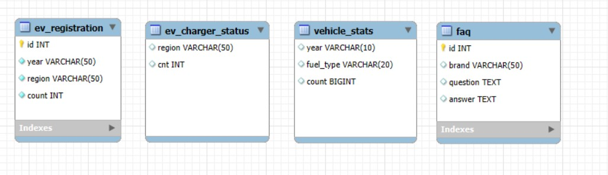

# 🚗 EV(전기차) 현황 분석 및 전기차 브랜드 FAQ

---

## 1. 팀 소개 🧑‍🤝‍🧑

   - 팀명 : hexa(헥사)
   - 팀원

| | | | |
|---|---|---|---|
|  <br> [김태빈](https://github.com/binibini90) |  <br> [김황현](https://github.com/python11021) |  <br> [나호성](https://github.com/BBuSang) |  <br> [이지은](https://github.com/jieun9508-cyber) |


---

## 2. 프로젝트 개요 📖

### 2-1. 프로젝트 명
        
- 전기차 현황 보고
        
### 2-2. 프로젝트 소개
         
- 대체 에너지를 활용한 자동차의 수요가 높아지는 추세에 맞춰 그의 대표적인 예시인 전기 자동차의 등록 현황을 분석하여 대중의 관심을 확인하고 관련 인프라의 한계를 알아보기 위한 프로젝트
        
### 2-3. 프로젝트 목표
         
- 전기차 연도별, 지역별 등록대수를 알아보고 그와 관련된 전기차 충전소의 지역적 분포 및 브랜드 별 FAQ를 크롤링하여 데이터로 시각화
        
### 2-4. 프로젝트 결과
         
- 데이터를 시각화 하여 증가하는 전기차 수요를 확인하고 충전소의 개수를 보며 현재 한계점을 분석하고 이해 할 수 있다.

---

## 3. 기술 스택  🛠

### 3.1. 프론트엔드  
-  : 웹 대시보드 프레임워크 (데이터 시각화 및 조회 시스템)  

### 3.2. 백엔드  
-  : 데이터 처리 및 비즈니스 로직 구현  
-  : 데이터베이스 관리 및 저장  
-  : 데이터 분석 및 필터링 처리  

---

## 4. 프로젝트 진행  🚀

### 4.1. 프로젝트 기획 및 회의
- 프로젝트 큰 방향 설정 및 목표 찾기 

### 4.2. 데이터 크롤링  
- 전기 자동차 등록현황
- 연료별 자동차 등록현황
- 전기차 충전소 현황
- 회사별 FAQ  

### 4.3. 데이터베이스 연결  
- MySQL 연동
- 데이터베이스 입력
- 워드클라우드 기반 분석 및 SQL 쿼리 연결 및 구현

### 4.4. 프론트 구현
- Streamlit 대시보드 구축
- 전기 자동차 등록현황 그래프 구축 및 지도로 현황 파악 가능한 UI구축
- 전기 자동차 비율 그래프 구축
- 충전소 현황 프론트 구성
- 각 회사 별 FAQ UI구성 및 조회 가능 서비스 구현

### 4.5. 발표자료 구성 및 제작
- 프로젝트 점검 및 테스트
- 테이블 명세서 제작
- 발표자료 제작

---

## 6. ERD (Entity-Relationship Diagram) 📊

### 테이블 구조
- ev_registration : 전기 자동차 등록현황
- ev_charger_status : 전기 자동차 충전소 현황
- vehicle_status : 연료별 차량 등록현황
- faq : 브랜드별 FAQ



## 7.프로젝트 실행 결과
## 7.1. 짜라락
## 7.2. 짜라락


## ⚙️ 실행 방법
```bash
# 저장소 클론
git clone https://github.com/SKNETWORKS-FAMILY-AICAMP/SKN20-1ST-6TEAM.git
cd SKN20-1ST-6TEAM

# 패키지 설치
pip install -r requirements.txt

# 실행
streamlit run app.py

# mac실행
python -m streamlit run ev_dashboard.py
