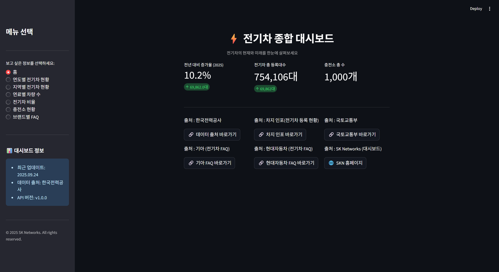
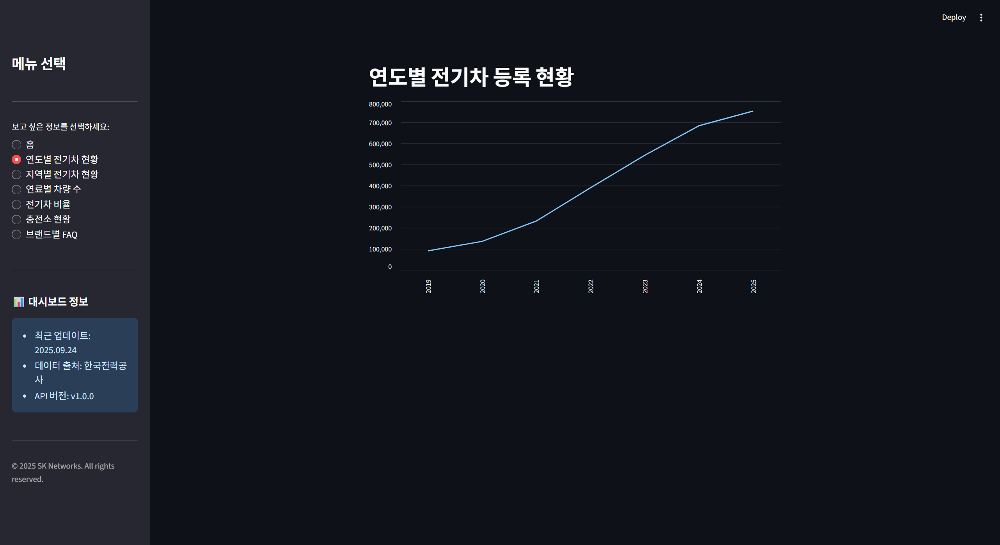
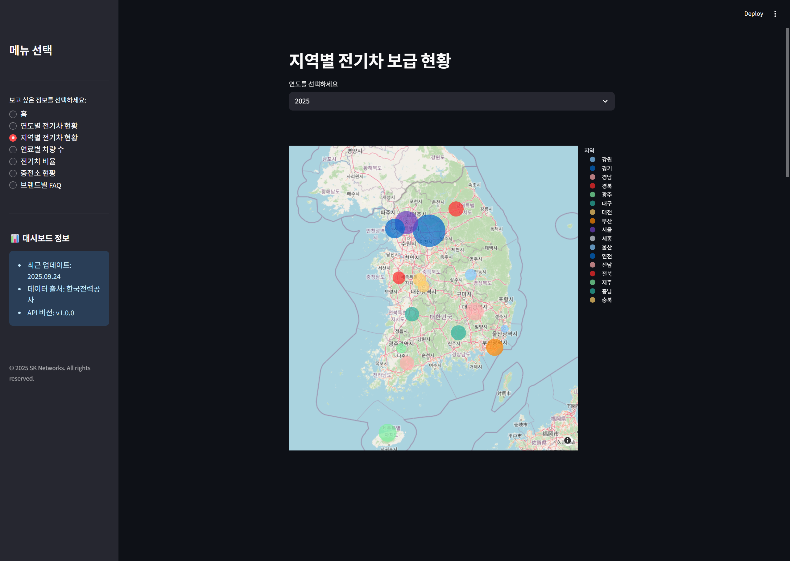
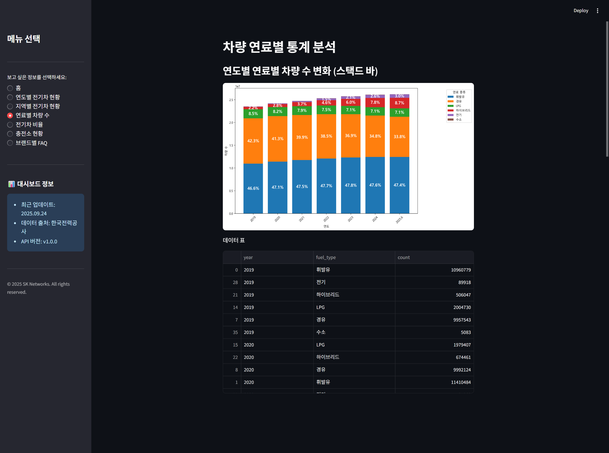
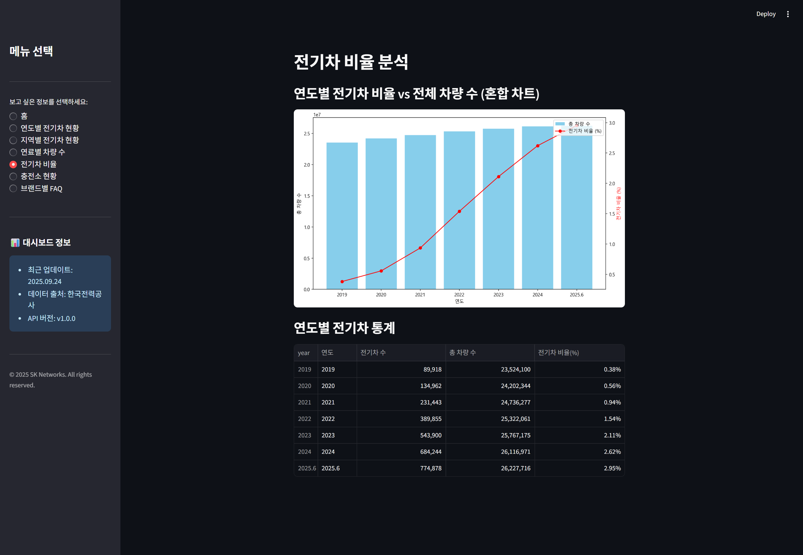
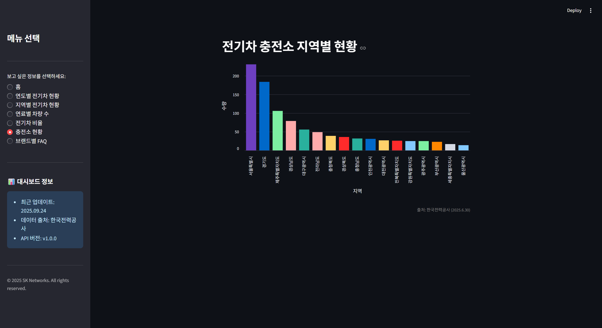
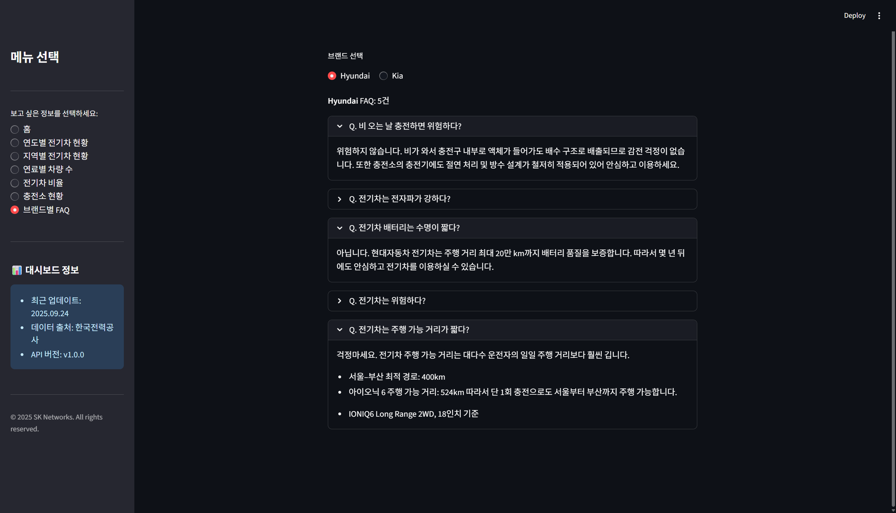

# 🚗 EV(전기차) 현황 분석 및 전기차 브랜드 FAQ

---

## 1. 팀 소개 🧑‍🤝‍🧑

   - 팀명 : hexa(헥사)
   - 팀원

| | | | |
|---|---|---|---|
|  <br> [김태빈](https://github.com/binibini90) |  <br> [김황현](https://github.com/python11021) |  <br> [나호성](https://github.com/BBuSang) |  <br> [이지은](https://github.com/jieun9508-cyber) |


---

## 2. 프로젝트 개요 📖

### 2-1. 프로젝트 명
        
- 전기차 현황 보고
        
### 2-2. 프로젝트 소개
         
- 대체 에너지를 활용한 자동차의 수요가 높아지는 추세에 맞춰 그의 대표적인 예시인 전기 자동차의 등록 현황을 분석하여 대중의 관심을 확인하고 관련 인프라의 한계를 알아보기 위한 프로젝트
        
### 2-3. 프로젝트 목표
         
- 전기차 연도별, 지역별 등록대수를 알아보고 그와 관련된 전기차 충전소의 지역적 분포 및 브랜드 별 FAQ를 크롤링하여 데이터로 시각화
        
### 2-4. 프로젝트 결과
         
- 데이터를 시각화 하여 증가하는 전기차 수요를 확인하고 충전소의 개수를 보며 현재 한계점을 분석하고 이해 할 수 있다.

---

## 3. 기술 스택  🛠

### 3.1. 프론트엔드  
-  : 웹 대시보드 프레임워크 (데이터 시각화 및 조회 시스템)  

### 3.2. 백엔드  
-  : 데이터 처리 및 비즈니스 로직 구현  
-  : 데이터베이스 관리 및 저장  
-  : 데이터 분석 및 필터링 처리  

---

## 4. 프로젝트 진행  🚀

### 4.1. 프로젝트 기획 및 회의
- 프로젝트 큰 방향 설정 및 목표 찾기 

### 4.2. 데이터 크롤링  
- 전기 자동차 등록현황
- 연료별 자동차 등록현황
- 전기차 충전소 현황
- 회사별 FAQ  

### 4.3. 데이터베이스 연결  
- MySQL 연동
- 데이터베이스 입력
- 워드클라우드 기반 분석 및 SQL 쿼리 연결 및 구현

### 4.4. 프론트 구현
- Streamlit 대시보드 구축
- 전기 자동차 등록현황 그래프 구축 및 지도로 현황 파악 가능한 UI구축
- 전기 자동차 비율 그래프 구축
- 충전소 현황 프론트 구성
- 각 회사 별 FAQ UI구성 및 조회 가능 서비스 구현

### 4.5. 발표자료 구성 및 제작
- 프로젝트 점검 및 테스트
- 테이블 명세서 제작
- 발표자료 제작

---

## 6. ERD (Entity-Relationship Diagram) 📊

### 테이블 구조
- ev_registration : 전기 자동차 등록현황
- ev_charger_status : 전기 자동차 충전소 현황
- vehicle_status : 연료별 차량 등록현황
- faq : 브랜드별 FAQ


## 7.프로젝트 실행 결과

## 7.1. 홈 화면
- 전기차 현황을 나타내는 홈화면으로 데이터 출처 남김


## 7.2. 연도별 전기차 현황
- 2019년부터 2025년까지 연도별 전기차 현황을 나타낸 그래프


## 7.3. 지역별 전기차 현황 지도
- 연도별로 지역마다 전기차 현황을 확인 할 수 있는 지도


## 7.4. 연료별 차량 수
- 연도별로 연로마다 차량 수의 변화를 나타낸 스택드 바


## 7.5. 전기차 비율
- 연도별 전기차 비율과 전체 차량수를 한눈에 보고 비교할 수 있는 차트


## 7.6. 충전소 현황
- 2025년 6월 기준으로 각 지역별 설치된 전기차 충전소 현황을 볼 수 있는 그래프


## 7.7. 브랜드 별 FAQ
- 각 브랜드마다 자주 나오는 질문과 답변을 확인 할 수 있는 페이지


### 8. 한줄 회고

- 김태빈 : 수업시간에 배운 크롤링을 유용하게 사용하여 데이터 수집, 분석을 통해 실력이 향상되는 것을 느꼈고, 프로젝트 만드는게 재밌었습니다.

  그리고 좋은 팀원을 만나서 팀원들이 같이 열심히 해줘서 편하고 쉽게 했던것 같고 데이터 구조에 대해 이해력이 많이 상승하는 좋은 프로젝트였습니다.

- 김황현 : 수업 때 배운 내용을 활용해 볼 수 있는 좋은 기회였고, AI의 능력을 느낄 수 있었습니다. 

  좋은 팀원들을 만나 팀워크도 잘 맞고 즐거운 시간이었습니다.

- 나호성 : 데이터 수집부터 대시보드 구현까지 직접 경험하며 실력이 한 단계 성장했고, 팀원들과 협력해 실제로 도움이 되는 서비스를 완성해 뿌듯했습니다.

- 이지은 : 1인분 하기에도 너무 부족한 실력이라 팀원분들이 많이 도와주셔서 감사하고 죄송했습니다.

  수업시간에 이론으로 배우는 것과 실제 팀 프로젝트로 활용하는 게 차이가 아주 많이 난다 느꼈고 앞으로 뒤쳐지지 않도록 열심히 공부해야겠다 느꼈습니다 감사합니다

## ⚙️ 실행 방법
```bash
# 저장소 클론
git clone https://github.com/SKNETWORKS-FAMILY-AICAMP/SKN20-1ST-6TEAM.git
cd SKN20-1ST-6TEAM

# 패키지 설치
pip install -r requirements.txt

# 실행
streamlit run app.py

# mac실행
python -m streamlit run ev_dashboard.py
